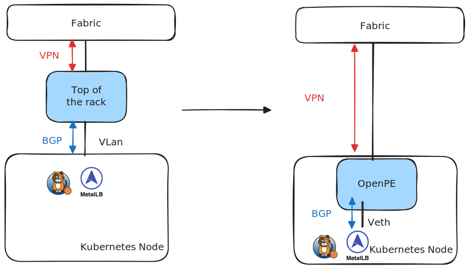
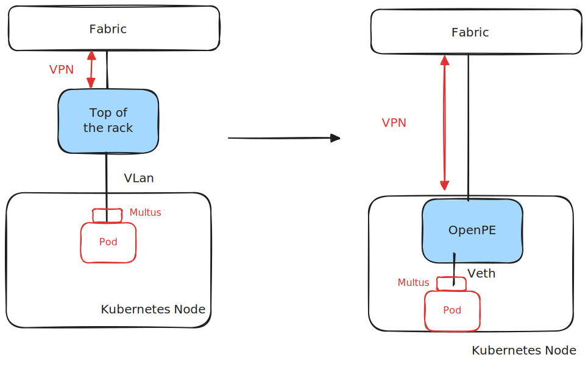

## OpenPERouter

Official docs at [openperouter.github.io](https://openperouter.github.io).

OpenPERouter is an open implementation of a Provider Edge (PE) router, designed to terminate multiple VPN protocols on Kubernetes nodes and expose a BGP interface to the host network.

**This project is in the early stage of development. Use carefully!**

## Enable L3 EVPN in your cluster

OpenPERouter enables L3 EVPN tunneling to any BGP enabled Kubernetes component,
such as Calico, MetalLB, KubeVip, Cilium, FRR-K8s and many others, behaving as an external router.

Behaving as an external router, the integration is seamless and BGP based, exactly as if a physical
Provider Edge Router was moved inside the node.

## Enable L2 EVPN in the cluster

OpenPERouter supports L2 overlays, allowing seamless communication between nodes using a stretched
layer 2 domain.

## Overview

Where we normally have a node interacting with the ToR (Top of Rack) switch, which is configured to map the VLans to a given VPN tunnel,
OpenPERouter runs directly in the node, exposing one Veth interface per VPN tunnel.

After OpenPERouter is configured and deployed on a cluster, it can interact with any BGP-speaking component of the cluster, including FRR-K8s, MetalLB, Calico and others. The abstraction is as if a physical Provider Edge Router was moved inside the node.

Here is a high level overview of the abstraction, on the left side a classic Kubernetes deployment connected via vlan interfaces, on the right side a deployment of OpenPERouter on a Kubernetes node:

L3:

L2:

## Check the documentation

The documentation can be found at [openperouter.github.io](https://openperouter.github.io).

## License

Copyright 2024.

Licensed under the Apache License, Version 2.0 (the "License");
you may not use this file except in compliance with the License.
You may obtain a copy of the License at

    http://www.apache.org/licenses/LICENSE-2.0

Unless required by applicable law or agreed to in writing, software
distributed under the License is distributed on an "AS IS" BASIS,
WITHOUT WARRANTIES OR CONDITIONS OF ANY KIND, either express or implied.
See the License for the specific language governing permissions and
limitations under the License.
