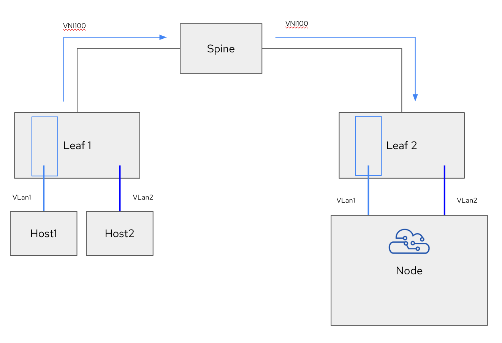
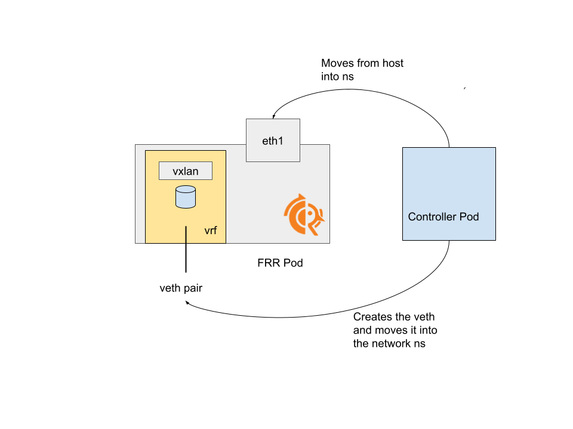

# Open PE Router

Open PE router is (without too much imagination) an open implementation of a PE router, intended to terminate multiple VPN protocols on Kubernetes nodes, exposing a BGP interface
with the rest of the host network.

This project is in the early stage of prototypation. Use carefully!


## Description

After OpenPE is configured and deployed on a cluster, it can interact with any BGP speaking component of the cluster, including FRR-K8s, MetalLB and others.

The provided abstraction is as if a physical Provider Edge Router was moved inside the node:



which becomes


The current architecture of OpenPE is as follows:




### The Router Daemonset

The router daemonset is the component in charge of implementing the various routing protocols (thanks to FRRRouting!) and to translate the routes received via EVPN to BGP routes:

- A veth leg for each VNI / logical VRF connects the router pod to the host
- FRR is configured to listen to incoming BGP session from each veth. All the routes coming via that session are mapped to type 5 EVPN routes sent via EVPN. Also, all the type 5 routes received via EVPN
are advertised via BGP through that session
- One host interface connected to the external router is moved into the namespace, to implement the underlay network

### The Controller Daemonset

The controller is the component in charge of:

- Generating the FRR configuration corresponding to the provided API
- Sending a signal to the router to reload the provided configuration
- Configuring the router's network namespace. This includes:
    - Moving the interface used for the underlay network
    - Creating the veth legs corresponding to each VNI
    - Creating the VXLan, VRF and linux bridge interfaces required by FRR to implement EVPN

## Getting Started

### To Deploy on the cluster

**Apply the all-in-one manifests**

`kubectl apply -f https://raw.githubusercontent.com/openperouter/openperouter/refs/heads/demoable/config/all-in-one/openpe.yaml`

or the crio variant (if your distribution uses crio)

`https://raw.githubusercontent.com/openperouter/openperouter/refs/heads/demoable/config/all-in-one/crio.yaml`

Note that running on Openshift will require extra scc to be added.

```bash
oc adm policy add-scc-to-user privileged -n openperouter-system -z openperouter-controller
oc adm policy add-scc-to-user privileged -n openperouter-system -z openperouter-perouter
```

Right after the deployment.

### Configuring it

More documentation will be provided, but for now it's important to mention that the configuration is split in two:

#### Configuring the underlay via the underlay CRD

```yaml
apiVersion: per.io.openperouter.github.io/v1alpha1
kind: Underlay
metadata:
  name: underlay
  namespace: openperouter-system
spec:
  asn: 64514
  vtepcidr:  100.65.0.0/24
  nic: eth1
  neighbors:
    - asn: 64512
      address: 192.168.11.2
```

Which includes:

- configuring the session with the external router
- configuring the interface connected to such router, which will be moved inside the pod (can be a vlan!)
- configuring the cidr of the ips to be assigned to the vteps across the nodes

#### Configuring each VNI

```yaml
apiVersion: per.io.openperouter.github.io/v1alpha1
kind: VNI
metadata:
  name: vni-sample
  namespace: openperouter-system
spec:
  asn: 64514
  vrf: red
  vni: 100
  vxlanport: 4789
  localcidr: 192.169.10.0/24
  localNeighbor:
    asn: 64515
    address: 192.169.10.0
    holdTime: 180s
    keepaliveTime: 60s
```

A single vni instance configures:

- the vrf name inside the pe router container (TODO: can be autogenerated)
- the vni to be used and associated to that logical vrf
- the cidr to be used for the veth pairs
- the details of the local session (over the veth leg extended to the node)


## Note

Currently, each vlan is going to get a different IP, and to configure the cloud native component to interact with the speaker, one must know what ip is assigned to each veth (on each node).
This has clearly room for improvement and it will be addressed. This is a poc after all!

## Seeing it in action

Once the Open PE is configured, any cloud native BGP speaker can be configured, assuming that the details of the sessions are known. Here is for example a MetalLB `BGPPeer` configuration that can
be used for that:

```yaml
apiVersion: metallb.io/v1beta2
kind: BGPPeer
metadata:
  name: red
  namespace: metallb-system
spec:
  myASN: 64515
  peerASN: 64514
  peerAddress: 192.169.10.1
```

By using that, all the services announced by MetalLB as BGP routes will be automatically translated and spread across the fabric as EVPN type 5 routes. At the same type, the VXLan encapsulated traffic
targeting the MetalLB services will be terminated on the OpenPE router pod's namespace and then redirected to the host namespace as plain traffic.

## License

Copyright 2024.

Licensed under the Apache License, Version 2.0 (the "License");
you may not use this file except in compliance with the License.
You may obtain a copy of the License at

    http://www.apache.org/licenses/LICENSE-2.0

Unless required by applicable law or agreed to in writing, software
distributed under the License is distributed on an "AS IS" BASIS,
WITHOUT WARRANTIES OR CONDITIONS OF ANY KIND, either express or implied.
See the License for the specific language governing permissions and
limitations under the License.
